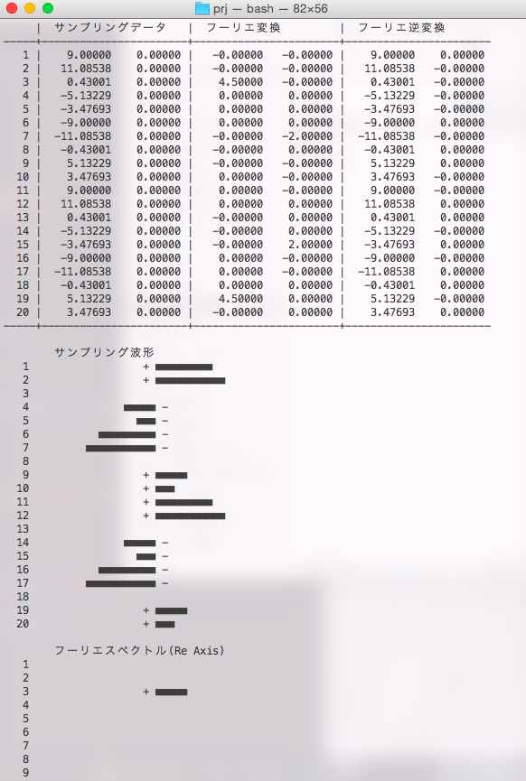

# Chirp Z-Transform
The CZT is similar to the FFT-Algorithm of the Discrete Fourier transform (used gcc compiler in makefile)
---

* C Language

* env (Linux/OS X)

* CZTs order - O(log(n^n))

* how to

    cd {projectname}/prj/
    make run

* make command
  * make --------- [make build]
  * make build --- create directory(obj and bin) and compile this project
  * make clean --- remove binary and object file(directory)
  * make clear --- [make clean]
  * make delete -- [make delete]
  * make rebuild - [make clean and make build]
  * make run ----- [make build] and execute binary file
  * make test ---- [make run and make clean]
  * make .PHONY -- [make build and make clean]

* screenshot

  

* about czt-algo : link to [wikipedia(Chirp Z-transform)][wikipe]

[wikipe]: http://en.wikipedia.org/wiki/Chirp_Z-transform
